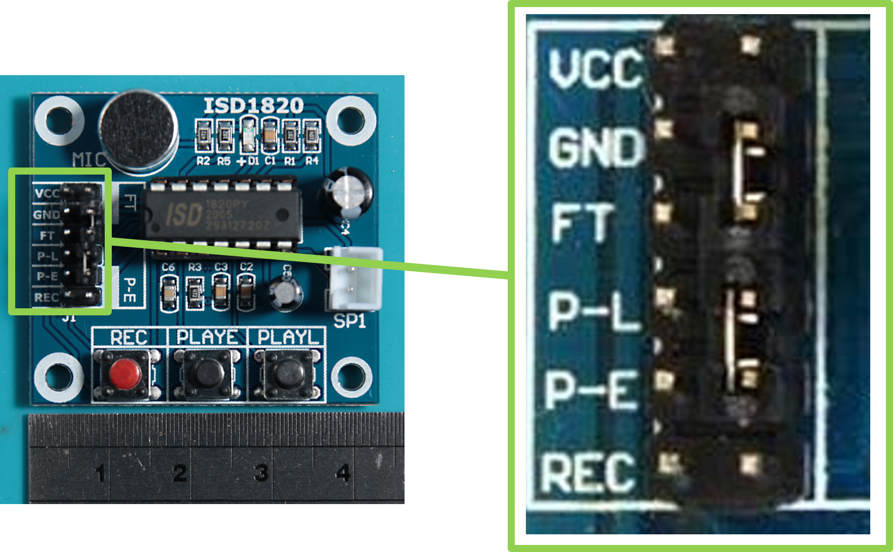

# stm32f4libs
------
## ISD1820 recording module API
This API was developed as part of the Embedded Systems Programming course at UFMG - Prof. Ricardo de Oliveira Duarte – Department of Electronic Engineering.

This API contains functions to provide use of some hardware resources from ISD 1820 recording module available at: <https://wiki.keyestudio.com/KS0463_keyestudio_ISD1820_Voice_Recording_and_Playback_Module>

## Module specifications:

- Module to record/play audios of up to 20 seconds.
- Non-volatile: EEPROM memory.
- Built-in microphone.
- Simple interface.
- Operation in standalone mode.
- Operating voltage: 3-5V DC.

## Hardware requirements:
- ISD 1820 recording module.
	Datasheet: <https://www.nuvoton.com/resource-files/EN_ISD1800_Datasheet_Rev_1.0.pdf>

Default pinout:

<table class="tg">
<thead>
  <tr>
    <th class="tg-nlhk">ISD1820</th>
    <th class="tg-nlhk">STM32F446RE</th>
    <th class="tg-nlhk">Description</th>
  </tr>
</thead>
<tbody>
  <tr>
    <td class="tg-c3ow">VCC</td>
    <td class="tg-c3ow">3.3V</td>
    <td class="tg-c3ow">Power source.</td>
  </tr>
  <tr>
    <td class="tg-c3ow">GND</td>
    <td class="tg-c3ow">GND</td>
    <td class="tg-c3ow">Ground.</td>
  </tr>
  <tr>
    <td class="tg-c3ow">FT</td>
    <td class="tg-c3ow">FT (GPIO_Output)</td>
    <td class="tg-c3ow">Feed Through: if HIGH, the microphone drives the speaker directly.</td>
  </tr>
  <tr>
    <td class="tg-c3ow">P-L</td>
    <td class="tg-c3ow">PL (GPIO_Output)</td>
    <td class="tg-c3ow">PLAY-L: Playback level-activated. While HIGH, it plays the audio stored on EEPROM, until it is over.</td>
  </tr>
  <tr>
    <td class="tg-c3ow">P-E</td>
    <td class="tg-c3ow">PE (GPIO_Output)</td>
    <td class="tg-c3ow">PLAY-E: Playback edge-activated. if HIGH, even for a short period, it plays the audio stored entirely.</td>
  </tr>
  <tr>
    <td class="tg-c3ow">REC</td>
    <td class="tg-c3ow">REC (GPIO_Output)</td>
    <td class="tg-c3ow">Recording pin. This pin must remain HIGH for the duration of the recording.</td>
  </tr>
  <tr>
    <td class="tg-c3ow">SP+</td>
    <td class="tg-c3ow">None</td>
    <td class="tg-c3ow">Speaker out.</td>
  </tr>
  <tr>
    <td class="tg-c3ow">SP-</td>
    <td class="tg-c3ow">None</td>
    <td class="tg-c3ow">Speaker out.</td>
  </tr>
</tbody>
</table>

This API was implemented and tested in STM32 Nucleo-64 with STM32f446RE MCU. However, it is possible to use it with any other board that has 4 GPIO-Ouput available, as listed in the table above. In this case, it is necessary to change the included files from the HAL library to the proper one,according to your MCU.

* STM32F446RET6 64 PINS.
		Manufacturer website: https://www.st.com/en/microcontrollers-microprocessors/stm32f446re.html
## Software requirements:
- STM32CubeIDE 1.6.1: Available at https://www.st.com/en/development-tools/stm32cubeide.html

## API main files:
* isd1820.c
* isd1820.h

### Authors:  
   * David Simon Marques - <davidsimon@ufmg.br>
   * Victor Araujo Sander Silva - <victorsander@gmail.com>

Institution: Universidade Federal de Minas Gerais (UFMG)
